# Лабораторная работа №2. Введение в WordPress

**Выполнила:** Новак Светлана  
**Группа:** IA2303  

---

## Цель работы

Научиться устанавливать WordPress в локальной среде, осваивать админ-панель, изменять внешний вид сайта через темы и расширять его функциональность с помощью плагинов.

---

## Шаг 1. Подготовка среды

Для создания локальной среды был установлен **XAMPP** — программа, которая превращает компьютер в локальный сервер.

**Выполненные действия:**
1. Скачан и установлен XAMPP
2. Запущены модули **Apache** и **MySQL** через панель управления XAMPP

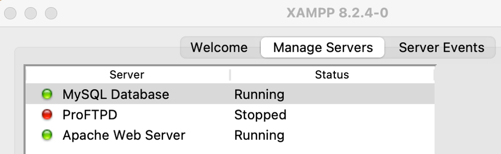

3. Проверена работа сервера — открыта страница `http://localhost` ✓

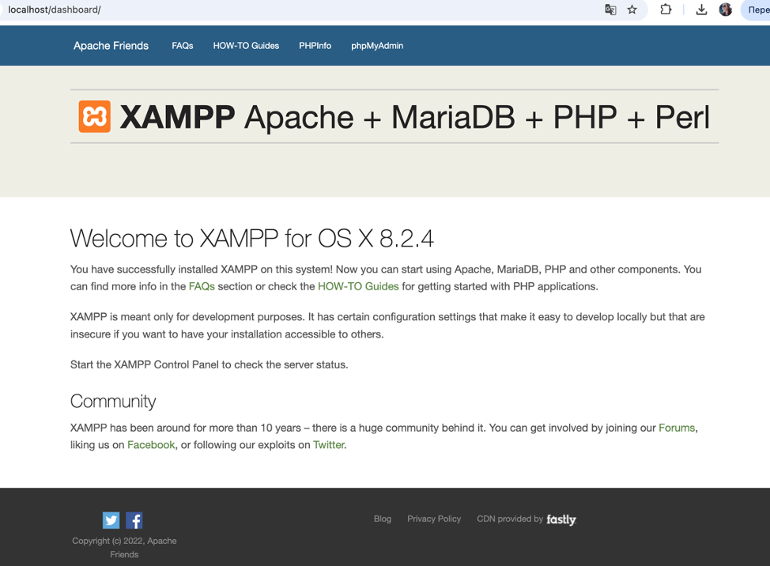

4. В **phpMyAdmin** (`http://localhost/phpmyadmin`) создана новая база данных `wp_lab2`

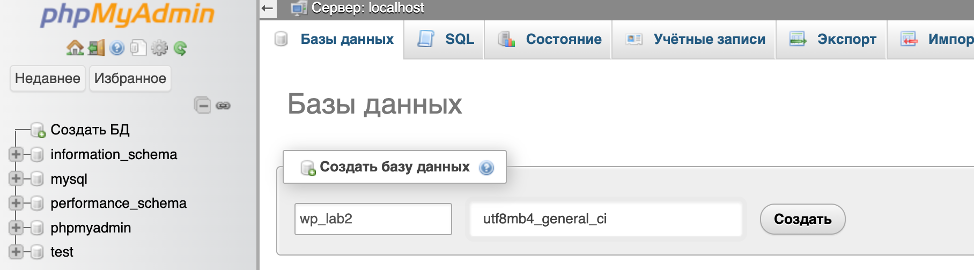
---

## Шаг 2. Установка WordPress

1. Скачан WordPress с официального сайта [wordpress.org](https://wordpress.org)
2. Архив распакован в папку `/Applications/XAMPP/xamppfiles/htdocs/wp_lab2`
3. В файл `wp-config.php` добавлена строка `define('FS_METHOD', 'direct');` для корректной работы установки плагинов
4. В браузере открыт адрес `http://localhost/wp_lab2` и пройден мастер установки:
   - Имя базы данных: `wp_lab2`
   - Имя пользователя БД: `root`
   - Пароль: *(пустой)*
   - Сервер БД: `localhost`
5. Задано название сайта, логин и пароль администратора

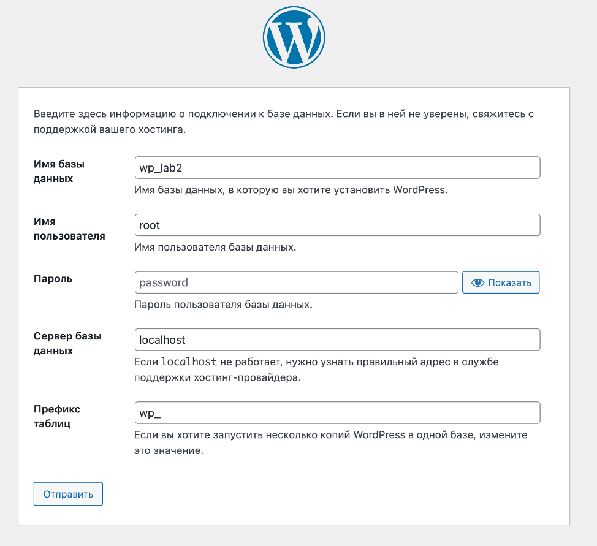

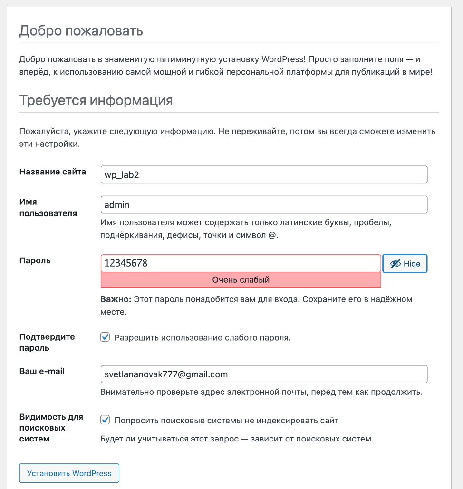

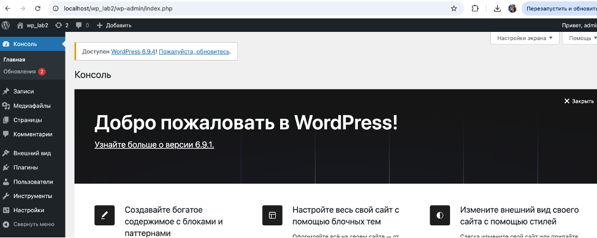

---

## Шаг 3. Первоначальные настройки сайта

### Общие настройки
Перейдено в раздел **Настройки → Общие**:
- Название сайта изменено на `Firebird`
- Часовой пояс установлен: `Europe/Chisinau`
- Сохранены изменения

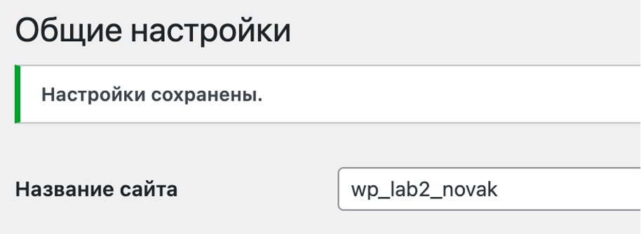

### Постоянные ссылки
Перейдено в раздел **Настройки → Постоянные ссылки**:
- Выбран вариант **Название записи** (Post name)
- Сохранены изменения

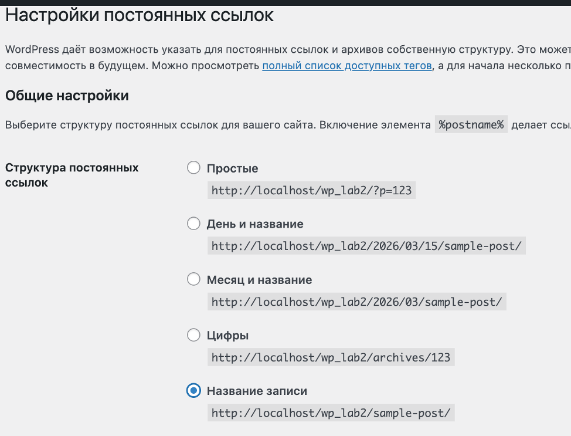

---

## Шаг 4. Работа с темами

### Установка темы Astra
1. Открыт раздел **Внешний вид → Темы**
2. Нажата кнопка **Добавить новую**
3. В поиске введено `Astra`
4. Тема установлена и активирована

После активации внешний вид сайта изменился — появился современный минималистичный дизайн вместо стандартной темы WordPress.

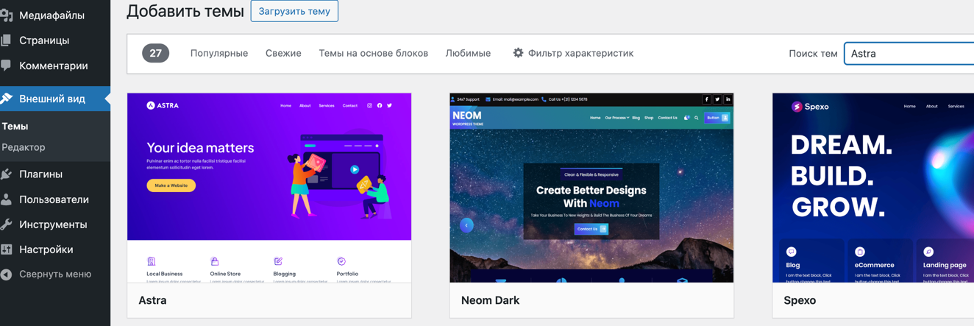

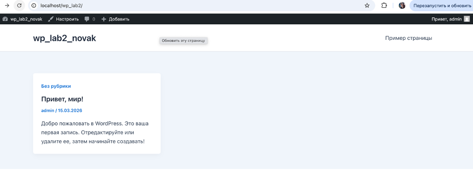


### Настройка внешнего вида
Открыт раздел **Внешний вид → Настроить**:

**Логотип** (Свойства сайта):
- Загружен логотип сайта — изображение Firebird (красная птица)

**Название и описание** (Свойства сайта):
- Название сайта: `Firebird`
- Краткое описание: `Возрождайся. Развивайся. Лети.`

**Цветовая схема** (Глобальные → Цвета):
- Выбран основной цвет в соответствии со стилем сайта


---

## Шаг 5. Работа с плагинами

### Установка плагинов
Открыт раздел **Плагины → Добавить новый**:

**Classic Editor:**
- Найден плагин `Classic Editor`
- Установлен и активирован
- Результат: в разделе «Записи → Добавить новую» открывается классический текстовый редактор

**Contact Form 7:**
- Найден плагин `Contact Form 7`
- Установлен и активирован
- Результат: в левом меню появился новый раздел «Контакты» с готовой формой `Contact form 1`

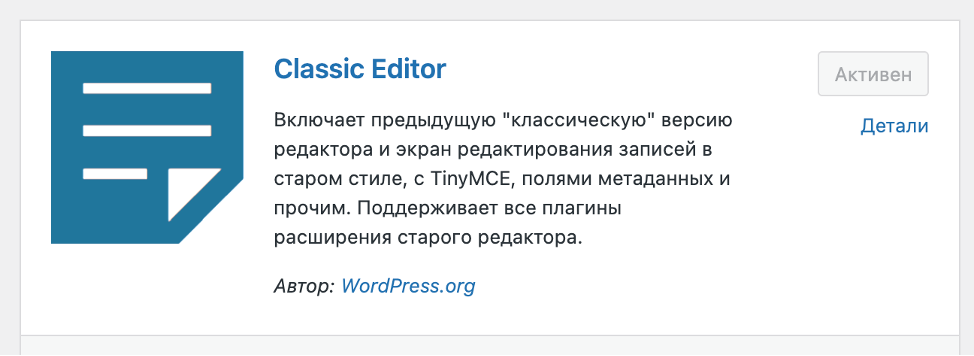

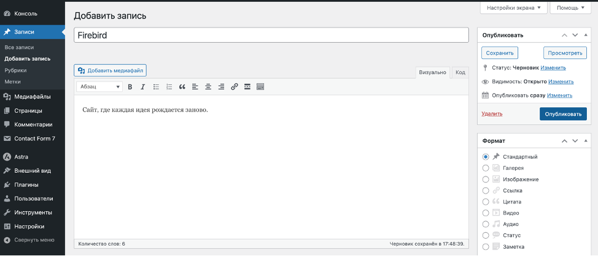

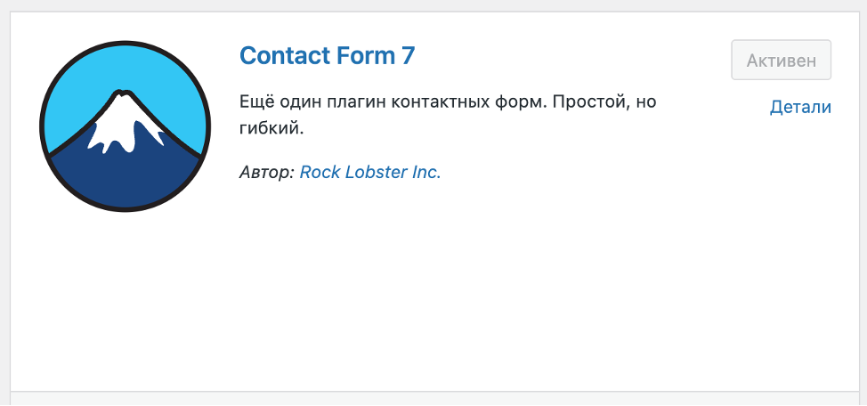

### Деактивация плагина
1. Открыт раздел **Плагины → Установленные плагины**
2. Плагин **Classic Editor** деактивирован
3. Проверен результат: открыт раздел **Записи → Добавить новую** — редактор изменился на блочный (Gutenberg), функциональность Classic Editor исчезла ✓

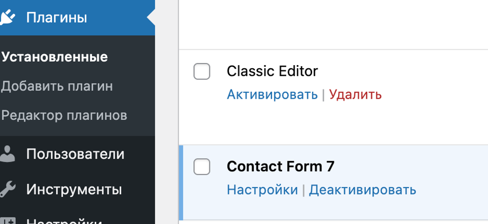

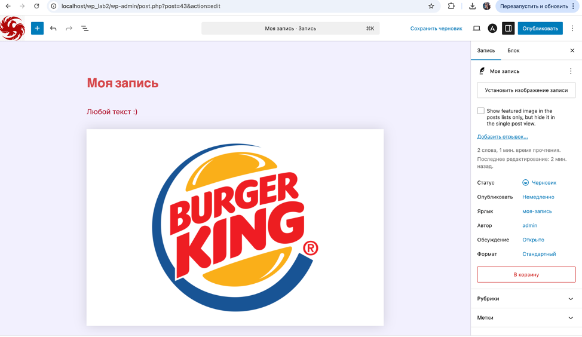

---

## Шаг 6. Создание контента

### Страница «Контакты»
1. Открыт раздел **Страницы → Добавить новую**
2. Задано название страницы: `Контакты`
3. В редактор вставлен шорткод формы Contact Form 7:
```
[contact-form-7 id="df30990" title="Без названия"]
```
4. Страница опубликована
5. Страница доступна по адресу: `http://localhost/wp_lab2/контакты/`

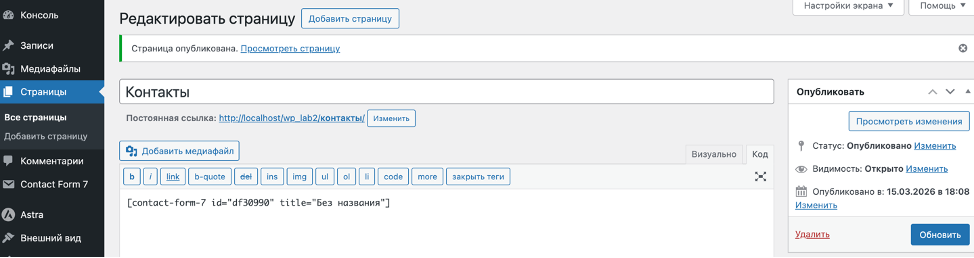

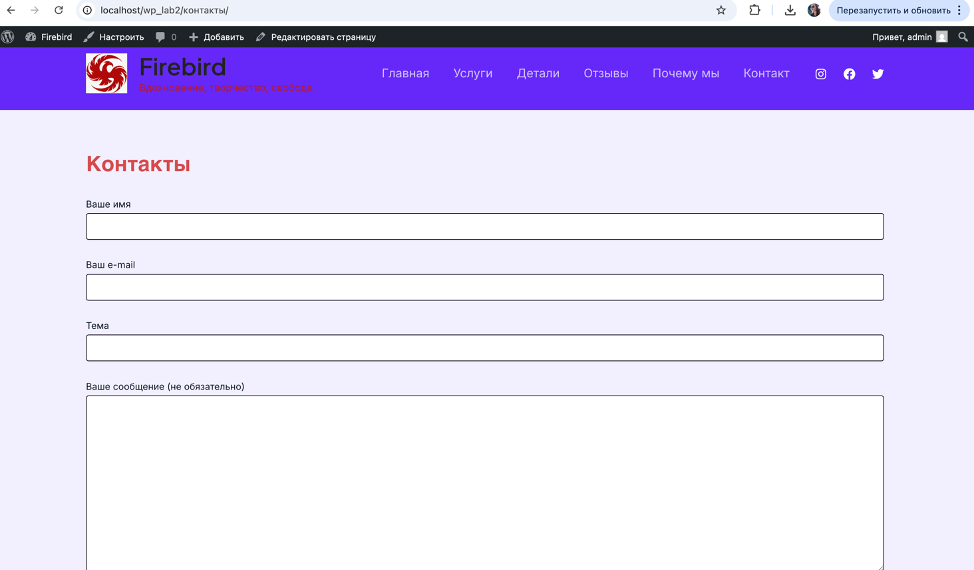

### Записи в блоге

**Запись 1 — «Добро пожаловать на Firebird»**
- Текст: *«Firebird — это место, где рождаются идеи. Здесь я делюсь своими мыслями, проектами и вдохновением. Как птица Феникс возрождается из пепла — так и каждая идея здесь получает новую жизнь.»*
- Добавлено изображение
- Запись опубликована ✓

**Запись 2 — «О сайте»**
- Текст: *«Этот сайт создан на платформе WordPress — самой популярной системе управления контентом в мире. Здесь вы найдёте статьи, новости и полезные материалы. Сайт постоянно развивается — заходите почаще, чтобы не пропустить новое.»*
- Добавлено изображение
- Запись опубликована ✓

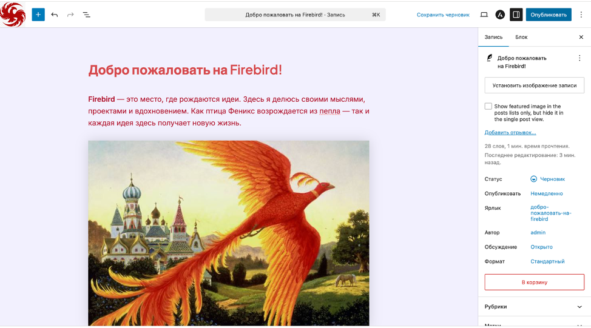

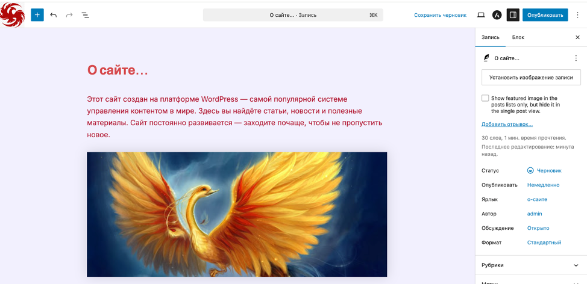

### Проверка отображения контента
Открыт сайт `http://localhost/wp_lab2`:
- Записи блога отображаются на главной странице ✓
- Страница «Контакты» с формой обратной связи открывается корректно ✓

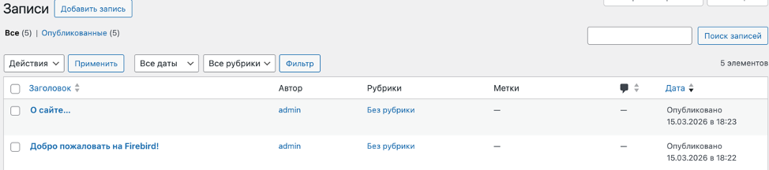


---

## Ответы на контрольные вопросы

### 1. Что делает тема в WordPress, а что — плагин?

**Тема** отвечает за **внешний вид** сайта — цвета, шрифты, расположение блоков, дизайн страниц. При смене темы меняется только оформление, но не содержимое.

**Плагин** отвечает за **функциональность** — добавляет новые возможности: форму обратной связи, интернет-магазин, SEO-настройки, галерею и т.д. Плагины работают независимо от темы.

Простая аналогия: тема — это одежда сайта, плагин — это инструмент или навык.

---

### 2. Почему при смене темы контент сайта не теряется?

Потому что контент (статьи, страницы, медиафайлы) хранится в **базе данных MySQL**, а тема — это только набор шаблонов для отображения этого контента. Тема и контент существуют отдельно друг от друга. При смене темы WordPress просто использует новые шаблоны для отображения тех же данных из базы.

---

### 3. Как можно изменить внешний вид сайта без редактирования кода?

В WordPress есть несколько способов:

- **Внешний вид → Настроить** — визуальный редактор для изменения цветов, шрифтов, логотипа, заголовка
- **Смена темы** — установить другую готовую тему из каталога
- **Page Builder плагины** — например Elementor позволяет строить страницы перетаскиванием блоков
- **Блочный редактор Gutenberg** — создание страниц из готовых блоков без кода

---

## Вывод

В ходе выполнения лабораторной работы была успешно установлена и настроена платформа WordPress в локальной среде на базе XAMPP. Были изучены основные разделы административной панели, установлена тема Astra и настроен внешний вид сайта. Установлены и протестированы плагины Classic Editor и Contact Form 7. Создана страница «Контакты» с формой обратной связи и две записи в блоге с текстом и изображениями.

Работа с WordPress показала, что платформа позволяет создавать полноценные сайты без знания программирования благодаря системе тем и плагинов.
